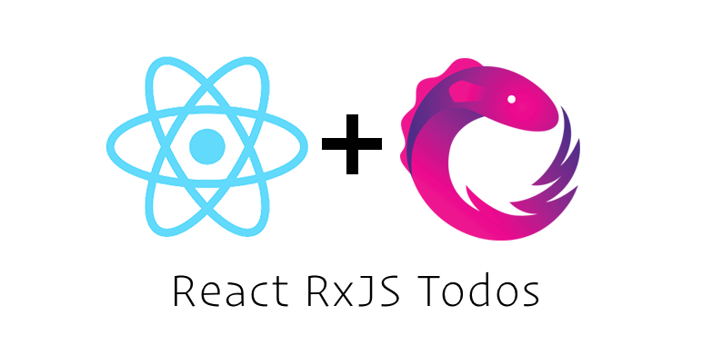

<p align="center">
  
</p>

# React RxJS + Hooks Todos

This repo shows a basic todos example base on the famous [TodoMVC](https://github.com/tastejs/todomvc) but using RxJS and React. The goal is to show how to use the Observables data architecture pattern within React. This implementation was inspired by the [React + RxJS TodoList](https://github.com/RxJS-CN/react-rxjs-todos).

## Install

> This React app was build with [create-react-app](https://github.com/facebookincubator/create-react-app).

```shell
# clone the repo
git clone git@github.com:subhog/react-rxjs-todos.git

# change into the repo directory
cd react-rxjs-todos

# install dependencies
npm install

# run
npm start
```

Then visit [http://localhost:3000](http://localhost:3000) in your browser.

## License

MIT
